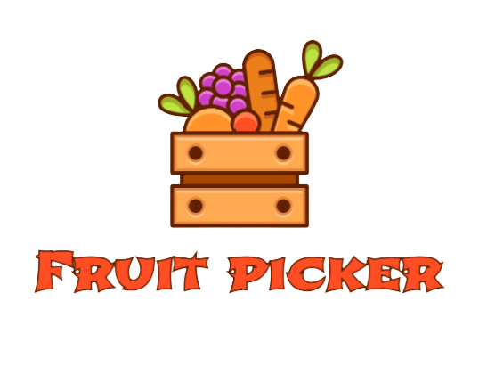

<h1 align="center">
  
</h1>

<p align="center">
  <a href="#-technologies">Technologies</a>&nbsp;&nbsp;&nbsp;|&nbsp;&nbsp;&nbsp;
  <a href="#-project">Project</a>&nbsp;&nbsp;&nbsp;|&nbsp;&nbsp;&nbsp;
  <a href="#-objectives">Objectives</a>&nbsp;&nbsp;&nbsp;|&nbsp;&nbsp;&nbsp;
  <a href="#-installation">Installation</a>&nbsp;&nbsp;&nbsp;&nbsp;&nbsp;&nbsp;

</p>

<p align="center">
 
</p>

## 🚀 Technologies

This project was developed with the following technologies:

- HTML
- CSS
- JavaScript

## 💻 Project

Fruit picker is a game developed using Javascript language, together with HTML and CSS.

## :memo: Objectives

The creation of this project was carried out aiming to improve concepts and techniques related to Javascript, CSS and HTML. Through the development of the game, it was possible to work on concepts related to:

- DOM manipulation
- Object manipulation
- Array manipulation
- Modules already
- CSS grid
- CSS flexbox
- Responsive layout
- Dynamic HTML generation, etc.


## 🚀 Installation

This project doesn't need any dependencies to work, so to run it just clone the repository:

```sh
  $ git clone https://github.com/hitaloalvess/game_fruit_picker.git
```

In order to run it directly in your browser, right-click on the `index.html` file, select the `Open with` option and choose the browser of your choice.
---
Made with ♥ by Hitalo 🚀
